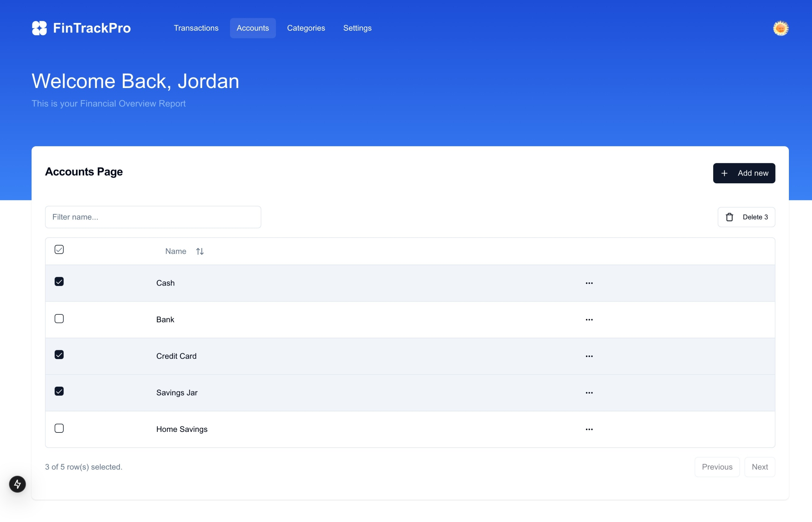
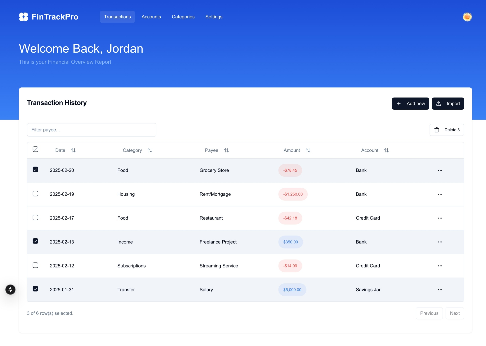

# FinTrackPro

FinTrackPro is a financial software-as-a-service (SaaS) application designed to help users manage their financial transactions efficiently. It provides a robust API for handling transactions, accounts, and categories with secure authentication and validation.

## Features

- User authentication and authorization
- CRUD operations for transactions
- Bulk creation and deletion of transactions
- Date range filtering for transactions
- Integration with accounts and categories
- Secure and validated API endpoints


## Screenshots

 

 

### relative response


## Getting Started

### Prerequisites

- Node.js (v14 or higher)
- npm or yarn
- Docker
- PostgreSQL database

### Installation

1. Clone the repository:

   ```bash
   git clone https://github.com/yourusername/fintrackpro.git
   cd fintrackpro
   ```

2. Install dependencies:

    ```bash
    npm install
    # or
    yarn install
    ```

3. Set up environment variables:
   Create a .env.local file in the root directory and add the following variables:

    ```bash
    NEXT_PUBLIC_CLERK_PUBLISHABLE_KEY=<NEXT_PUBLIC_CLERK_PUBLISHABLE_KEY>
    CLERK_SECRET_KEY=<CLERK_SECRET_KEY>
    NEXT_PUBLIC_CLERK_SIGN_IN_URL=/sign-in
    NEXT_PUBLIC_CLERK_SIGN_UP_URL=/sign-up
    CLERK_PUBLISHABLE_KEY=<CLERK_PUBLISHABLE_KEY>
    DATABASE_URL=<DATABASE_URL>
    NEXT_PUBLIC_APP_URL=http://localhost:3000
    ```

### Running the Application Locally

  * To start the application locally, run:

      ```bash
      npm run dev
      # or
      yarn dev
      ```

## Backend API

### Transactions

* `GET /api/transactions`: Retrieve transactions with optional date range and account filtering.
* `GET /api/transactions/:id`: Retrieve a specific transaction by ID.
* `POST /api/transactions`: Create a new transaction.
* `POST /api/transactions/bulk-create`: Bulk create transactions.
* `POST /api/transactions/bulk-delete`: Bulk delete transactions.
* `PATCH /api/transactions/:id`: Update a specific transaction by ID.
* `DELETE /api/transactions/:id`: Delete a specific transaction by ID.

### Accounts

* `GET /api/accounts`: Retrieve all accounts.
* `GET /api/accounts/:id`: Retrieve a specific account by ID.
* `POST /api/accounts`: Create a new account.
* `PATCH /api/accounts/:id`: Update a specific account by ID.
* `DELETE /api/accounts/:id`: Delete a specific account by ID.

### Categories

* `GET /api/categories`: Retrieve all categories.
* `GET /api/categories/:id`: Retrieve a specific category by ID.
* `POST /api/categories`: Create a new category.
* `PATCH /api/categories/:id`: Update a specific category by ID.
* `DELETE /api/categories/:id`: Delete a specific category by ID.


## Contributing
Contributions are welcome! Please open an issue or submit a pull request for any changes or improvements.

## License
This project is licensed under the MIT License. See the LICENSE file for details.

## Contact
For any questions or inquiries, please contact jordantamsc@gmail.com.com.